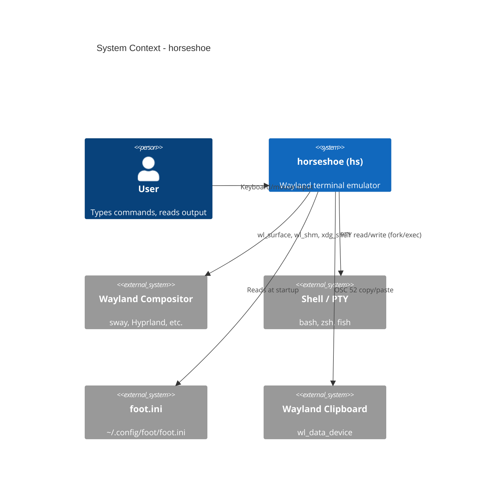

# 3. Context and Scope

## Business Context

horseshoe sits between the user's shell and the Wayland compositor, translating terminal I/O into rendered pixels.

## System Context (C4 Level 1)

## Technical Context

| Interface | Protocol / Mechanism | Direction |
|-----------|---------------------|-----------|
| Display output | Wayland wl_shm + wl_surface | hs -> compositor |
| Window management | xdg_shell (toplevel) | hs <-> compositor |
| Keyboard input | wl_keyboard + XKB | compositor -> hs |
| Mouse input | wl_pointer | compositor -> hs |
| Shell I/O | PTY (fork/exec) | hs <-> shell |
| Clipboard | wl_data_device (OSC 52) | hs <-> compositor |
| Bell urgency | xdg_activation | hs -> compositor |
| Configuration | INI file read | config -> hs |
