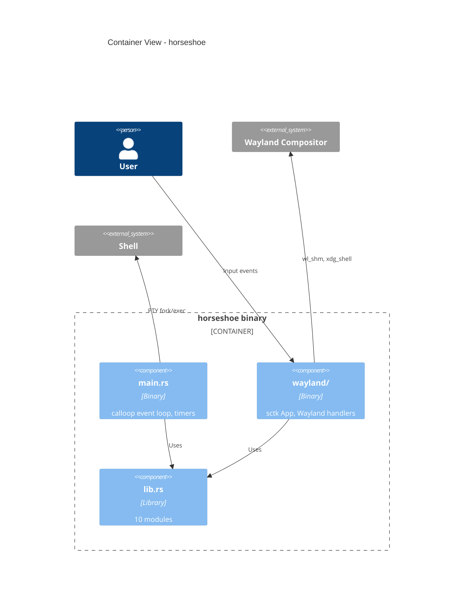
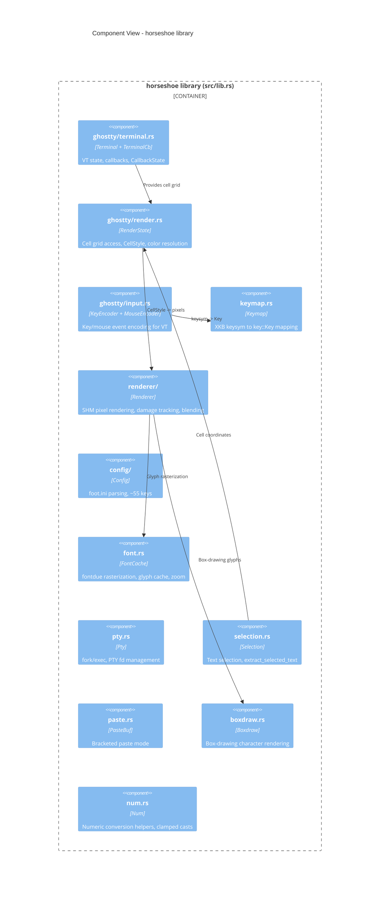

# 5. Building Block View

## Container View (C4 Level 2)

horseshoe is a single binary with an embedded library crate.

## Component View (C4 Level 3)

The library crate exposes 10 modules:

## Module Responsibilities

| Module | File | Responsibility |
|--------|------|---------------|
| `ghostty::terminal` | `src/ghostty/terminal.rs` | `Terminal` (no callbacks) and `TerminalCb` (with callbacks) wrapping `libghostty_vt::Terminal`. `CallbackState` accumulates PTY responses, bell, title, grid size. |
| `ghostty::render` | `src/ghostty/render.rs` | `RenderState` wraps terminal for cell grid access. `CellStyle` + `CellStyleAttrs` bitfield for per-cell styling. Color resolution (256-color, RGB, default). |
| `ghostty::input` | `src/ghostty/input.rs` | `KeyEncoder` translates key events into VT escape sequences. `MouseEncoder` handles mouse reporting. `encode_focus()` for focus in/out. |
| `keymap` | `src/keymap.rs` | Maps XKB keysyms to `libghostty_vt::key::Key` enum. `ModifierState` newtype over `key::Mods`. |
| `renderer` | `src/renderer/` | SHM buffer pixel rendering. `Surface`, `Rect`, `GridMetrics`. Damage tracking, alpha blending with fast div-255. |
| `config` | `src/config/` | Parses `~/.config/foot/foot.ini`. ~55 config keys across `[main]`, `[cursor]`, `[colors]`, `[key-bindings]`. `Bindings` struct + `KeyAction` enum. |
| `font` | `src/font.rs` | `FontCache` with fontdue rasterization. Glyph caching, `rebuild_at_size()` for zoom (skips filesystem rescan). |
| `pty` | `src/pty.rs` | `Pty::spawn` via fork/exec. `SpawnOptions` struct. PTY fd read/write. |
| `selection` | `src/selection.rs` | Grid text selection. `extract_selected_text` with single-String accumulator. |
| `paste` | `src/paste.rs` | `PasteBuf` for bracketed paste mode handling. |
| `num` | `src/num.rs` | Numeric conversion helpers (`f32_metric_to_u32`, `float_to_i64`, clamped casts). |
| `boxdraw` | `src/boxdraw.rs` | Pixel-perfect box-drawing and block character rendering. |
