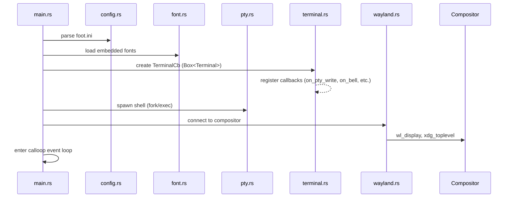
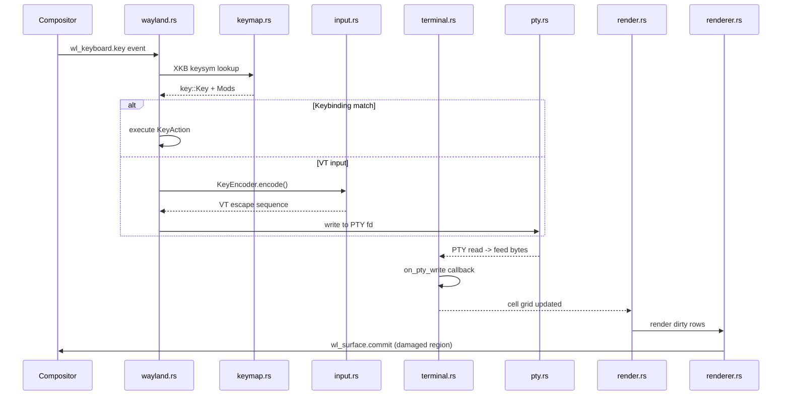
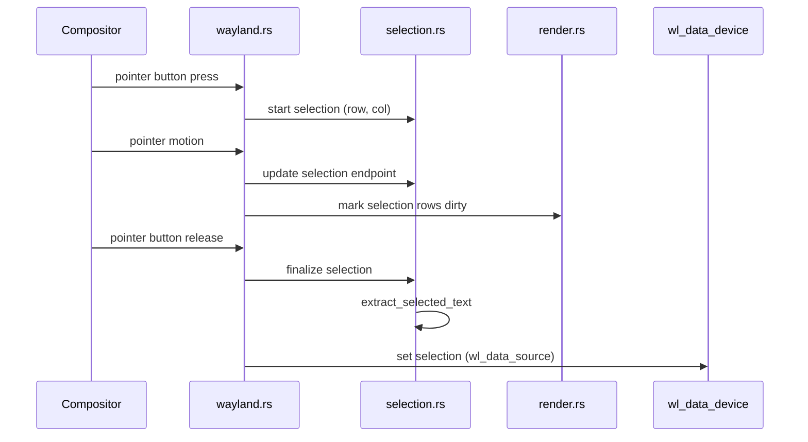
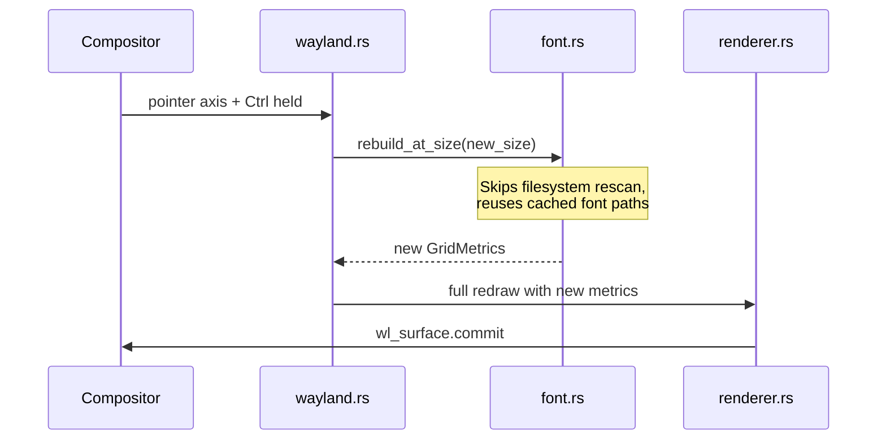
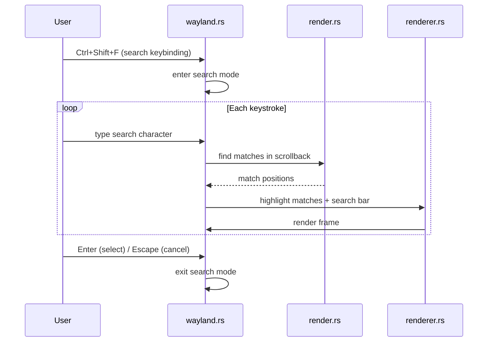

# 6. Runtime View

## Startup Sequence

```mermaid
sequenceDiagram
    participant Main as main.rs
    participant Config as config.rs
    participant Font as font.rs
    participant Pty as pty.rs
    participant Terminal as terminal.rs
    participant Wayland as wayland.rs
    participant Compositor

    Main->>Config: parse foot.ini
    Main->>Font: load embedded fonts
    Main->>Terminal: create TerminalCb (Box<Terminal>)
    Terminal-->>Terminal: register callbacks (on_pty_write, on_bell, etc.)
    Main->>Pty: spawn shell (fork/exec)
    Main->>Wayland: connect to compositor
    Wayland->>Compositor: wl_display, xdg_toplevel
    Main->>Main: enter calloop event loop
```

## Keypress to Render

```mermaid
sequenceDiagram
    participant Compositor
    participant Wayland as wayland.rs
    participant Keymap as keymap.rs
    participant Input as input.rs
    participant Terminal as terminal.rs
    participant Pty as pty.rs
    participant Render as render.rs
    participant Renderer as renderer.rs

    Compositor->>Wayland: wl_keyboard.key event
    Wayland->>Keymap: XKB keysym lookup
    Keymap-->>Wayland: key::Key + Mods

    alt Keybinding match
        Wayland->>Wayland: execute KeyAction
    else VT input
        Wayland->>Input: KeyEncoder.encode()
        Input-->>Wayland: VT escape sequence
        Wayland->>Pty: write to PTY fd
    end

    Pty-->>Terminal: PTY read -> feed bytes
    Terminal->>Terminal: on_pty_write callback
    Terminal-->>Render: cell grid updated
    Render->>Renderer: render dirty rows
    Renderer->>Compositor: wl_surface.commit (damaged region)
```

## Text Selection

```mermaid
sequenceDiagram
    participant Compositor
    participant Wayland as wayland.rs
    participant Selection as selection.rs
    participant Render as render.rs
    participant Clipboard as wl_data_device

    Compositor->>Wayland: pointer button press
    Wayland->>Selection: start selection (row, col)
    Compositor->>Wayland: pointer motion
    Wayland->>Selection: update selection endpoint
    Wayland->>Render: mark selection rows dirty
    Compositor->>Wayland: pointer button release
    Wayland->>Selection: finalize selection
    Selection->>Selection: extract_selected_text
    Wayland->>Clipboard: set selection (wl_data_source)
```

## Font Zoom (Ctrl+Scroll)

```mermaid
sequenceDiagram
    participant Compositor
    participant Wayland as wayland.rs
    participant Font as font.rs
    participant Renderer as renderer.rs

    Compositor->>Wayland: pointer axis + Ctrl held
    Wayland->>Font: rebuild_at_size(new_size)
    Note over Font: Skips filesystem rescan,<br/>reuses cached font paths
    Font-->>Wayland: new GridMetrics
    Wayland->>Renderer: full redraw with new metrics
    Renderer->>Compositor: wl_surface.commit
```

## Search Mode

```mermaid
sequenceDiagram
    participant User
    participant Wayland as wayland.rs
    participant Render as render.rs
    participant Renderer as renderer.rs

    User->>Wayland: Ctrl+Shift+F (search keybinding)
    Wayland->>Wayland: enter search mode
    loop Each keystroke
        User->>Wayland: type search character
        Wayland->>Render: find matches in scrollback
        Render-->>Wayland: match positions
        Wayland->>Renderer: highlight matches + search bar
        Renderer->>Wayland: render frame
    end
    User->>Wayland: Enter (select) / Escape (cancel)
    Wayland->>Wayland: exit search mode
```
