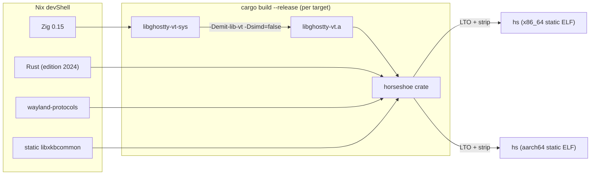

# 7. Deployment View

## Build Pipeline

## Deployment Artifact

| Property | Value |
|----------|-------|
| Binary name | `hs` |
| Targets | `x86_64-unknown-linux-musl`, `aarch64-unknown-linux-musl` |
| Linking | Fully static (musl libc) |
| LTO | Fat LTO, single codegen unit |
| Strip | Enabled |
| Panic | Abort |
| Runtime dependencies | None |

## Configuration Path

| File | Purpose |
|------|---------|
| `~/.config/foot/foot.ini` | User configuration (shared with foot) |

No other files are read from the filesystem at runtime. Fonts are embedded in the binary.

## Runtime Environment

The binary requires only:

- A running Wayland compositor (sway, Hyprland, GNOME, KDE, etc.)
- A Wayland socket (`$WAYLAND_DISPLAY`)
- A working PTY subsystem (`/dev/ptmx`)
